# Classical Simulation of Quantum Circuits using Tensor Networks (Ongoing Work)

## Overview

This repository documents ongoing work and findings from a research internship focused on the classical simulation of quantum circuits using Tensor Networks, specifically Matrix Product States (MPS) as of now. The primary objective is to explore and advance the capabilities of TN-based methods for simulating Quantum Approximate Optimization Algorithms (QAOA) for combinatorial optimization problems and to investigate Quantum Supremacy. The Python framework used for these simulations is under continuous development and refinement.

## Project Scope & Methods

The project involves:

- **Theoretical Foundations:** Deep understanding and implementation of MPS, various tensor decompositions (SVD, QR, RQ), canonical forms, and QAOA's principles (origins, Hamiltonians, problem mapping).
- **Python Framework:** Development of a modular Python framework leveraging NumPy for efficient tensor operations, implementing core MPS functionalities (canonicalization, gate application, utilities) and QAOA simulation routines.
- **Simulation Approaches:** Implementation and analysis of both exact and inexact (SVD and Variational) compression strategies.

## Key Results from Stage 1

The simulations presented here are initial findings, primarily conducted on the Linear Max-Cut problem, mapping it through QUBO to an Ising Hamiltonian.

### 1. Entanglement Growth: Exact Simulation

**Initial Observation:** In exact simulations (without compression), the maximum bond dimension (χ) of the MPS exhibits exponential growth with both the number of nodes (N) and the number of QAOA layers (p). This underscores the fundamental classical simulation bottleneck.

| Max Bond Dimension vs. Number of Nodes (N) | Max Bond Dimension vs. QAOA Layers (p) |
| :----------------------------------------: | :------------------------------------: |
| 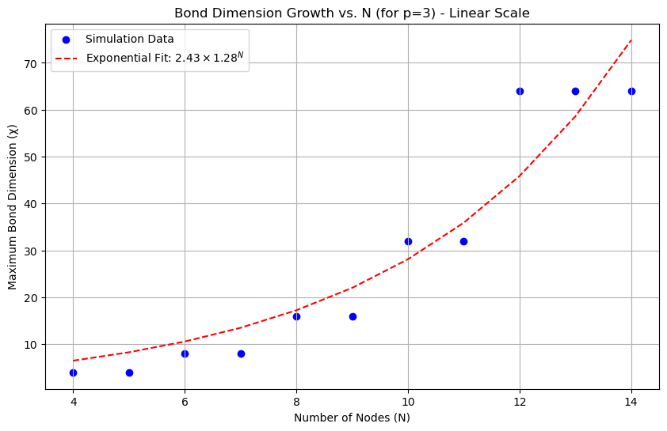 | 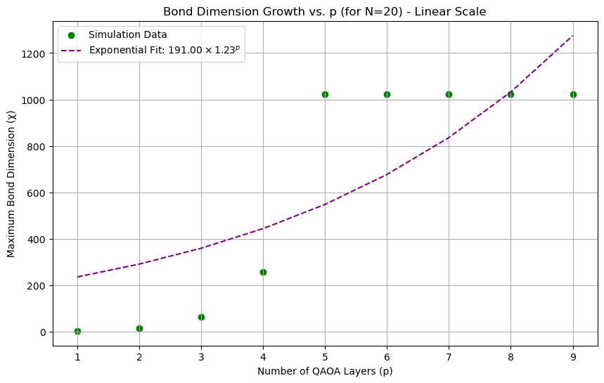 |

### 2. Entanglement Growth: Exact vs. Compressed Simulation

**Initial Observation:** Implementing compression strategies effectively caps the bond dimension at a fixed maximum value (χ_max = 4), regardless of the increasing system size (N) or circuit depth (p).

**Implication:** This capping enables polynomial scaling of simulation cost, making it feasible to analyze much larger or deeper quantum circuits than exact methods.

| Max Bond Dimension vs. Number of Nodes (N) | Max Bond Dimension vs. QAOA Layers (p) |
| :----------------------------------------: | :------------------------------------: |
| 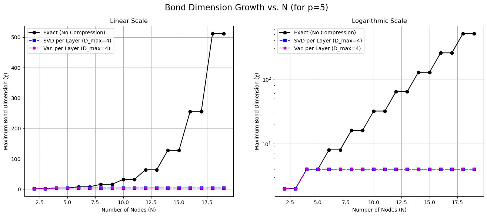 | 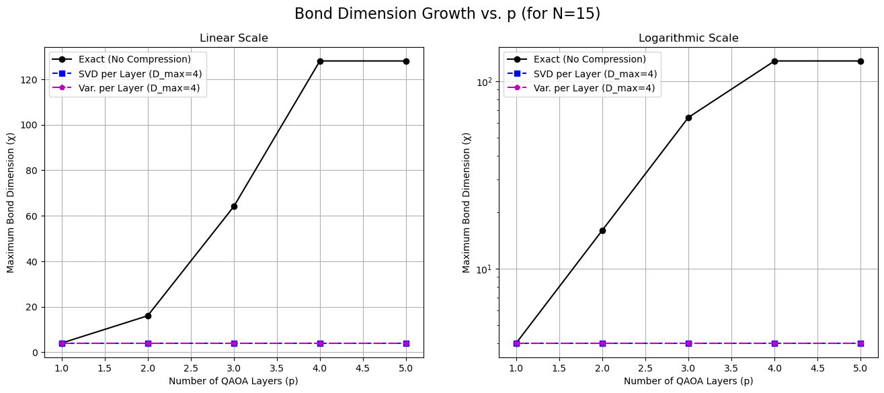 |

### 3. Infidelity Analysis: Exact Reference

**Goal:** To quantify the approximation error (infidelity = 1 − |⟨Ψ_exact|Ψ_inexact⟩|²) by comparing against a computationally generated exact state (Ψ_exact) for small systems.

**Strategies Compared (χ_max = 4):**
- SVD per Layer, Variational per Layer
- SVD at End, Variational at End

**Initial Findings:**
- Infidelity generally increases with N and p.
- "Per Layer" compression methods tend to yield higher or equal infidelity compared to "at End" methods.
- Variational compression consistently outperforms SVD compression, achieving lower infidelity.

| Infidelity vs. Number of Nodes (N) | Infidelity vs. QAOA Layers (p) |
| :--------------------------------: | :----------------------------: |
| 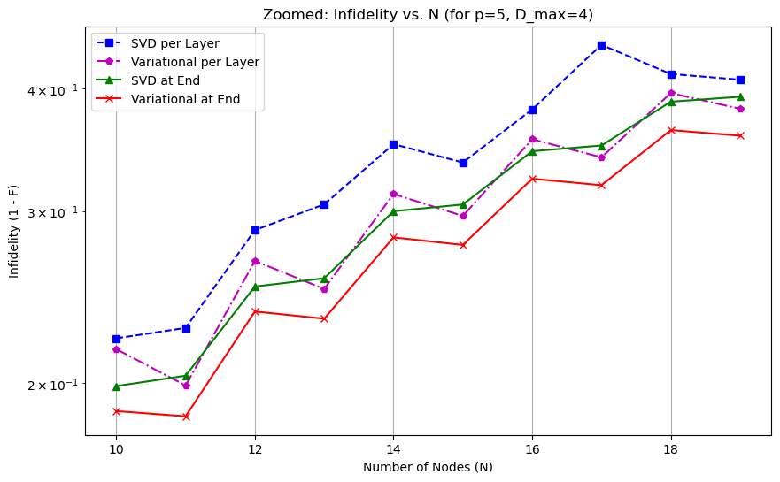 | 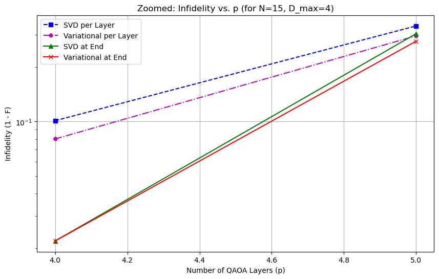 |

### 4. Validating Inexact Fidelity Estimation

**Challenge:** For large quantum systems, the exact state (Ψ_exact) is computationally unreachable.

**Solution:** The Multiplicative Fidelity Law (F_total ≈ ∏ f_δ) is used to estimate infidelity from local partial fidelities calculated during the inexact simulation.

**Initial Validation:** The estimated infidelity closely tracks the true infidelity for small systems.

**Implication:** This validation confirms that the Multiplicative Fidelity Law provides a reliable method to assess simulation accuracy even when exact results are unknown.

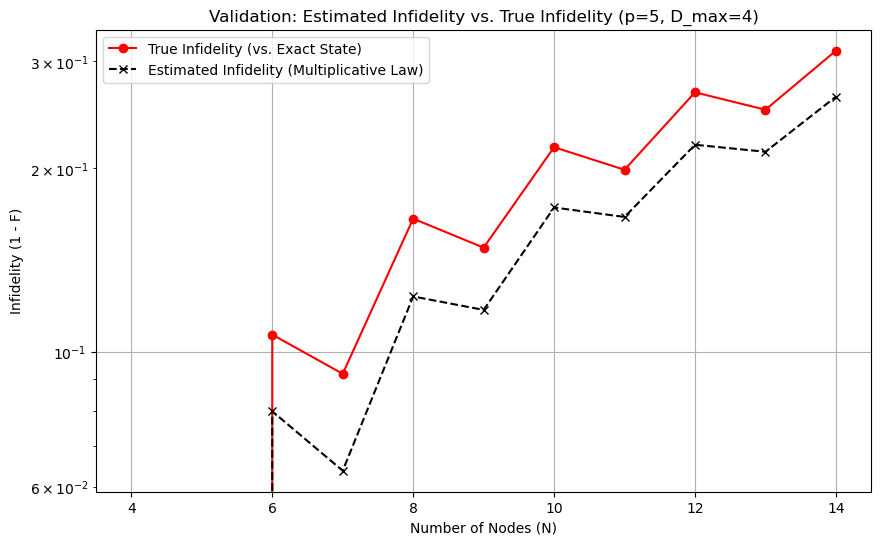

### 5. Performance of Inexact Simulations (Estimated Infidelity)

**Method:** Evaluating the performance of inexact simulations by plotting the estimated infidelity (using the Multiplicative Fidelity Law) for fixed χ_max = 4.

**Initial Finding:** The estimated infidelity shows a saturating trend as both the number of nodes (N) and QAOA layers (p) increase.

**Implication:** This indicates a predictable error profile for scalable quantum circuit analysis.

| Estimated Infidelity vs. Number of Nodes (N) | Estimated Infidelity vs. QAOA Layers (p) |
| :------------------------------------------: | :--------------------------------------: |
| 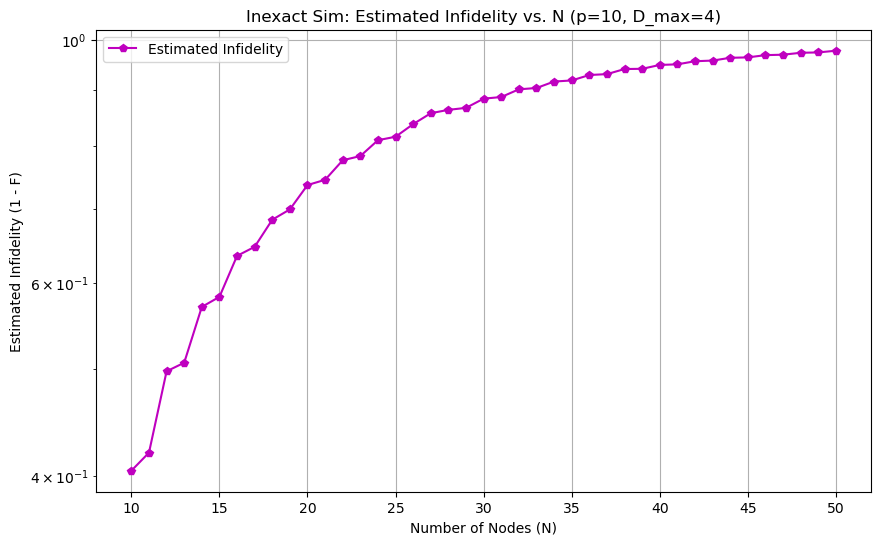 | 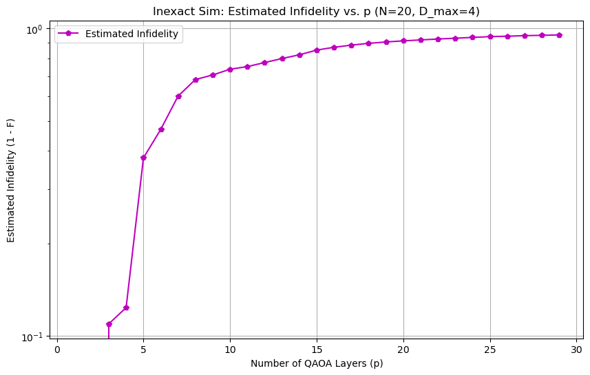 |

## Key Results from Stage 2

This stage focused on validating the simulation framework and benchmarking its performance on complex, non-linear graph topologies. The simulation loop was implemented in a robust DMRG-style "evolve-then-compress" cycle, where variational compression is applied after each Trotter sub-layer. Swapping and unswapping correctly becomes very important for non-linear graphs.

### 1. Infidelity Scaling for Different Topologies

**Goal:** To provide detailed data on how simulation error scales with system size (N) and circuit depth (p) for a fixed, small bond dimension (D_max=4).

**Findings:**

For the Linear Chain, error is near-zero until a critical depth (p=3) or size, where it jumps to a saturation point (an "entanglement cliff").

For the Complete Graph, error starts high and grows steadily with each added layer or node, showing the high and immediate cost of simulating complex connectivity.

| Estimated Infidelity vs. Number of Nodes (N) | Estimated Infidelity vs. QAOA Layers (p) |
| :------------------------------------------: | :--------------------------------------: |
| 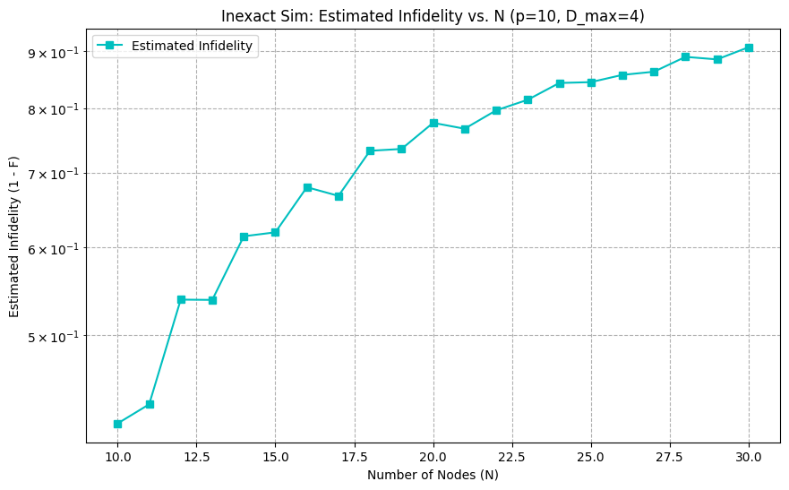 | 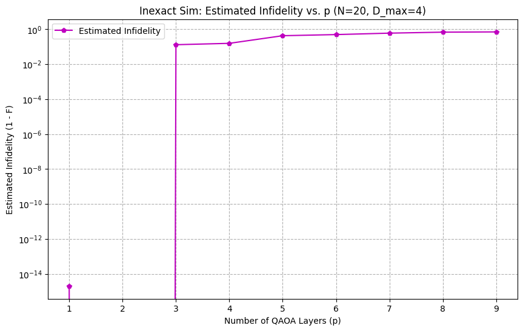 |
| 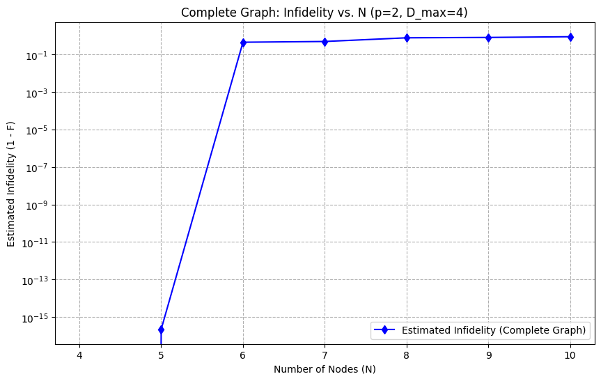 | 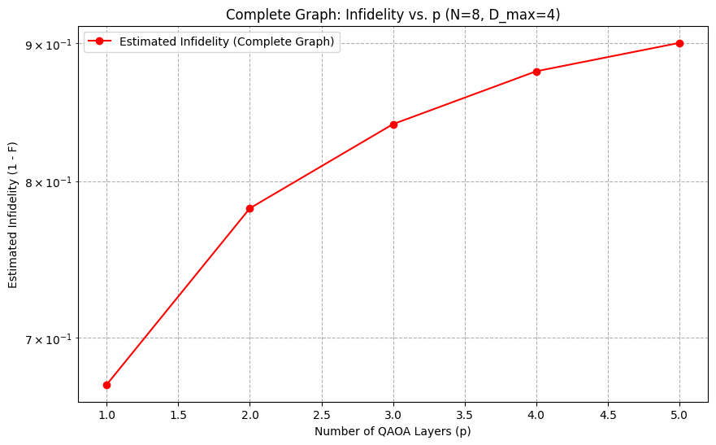 |

### 2. Validation: The Multiplicative Fidelity Law Holds
Goal: To confirm that our internal error estimation is reliable, even for highly entangling circuits.

**Method:** On a small but complex complete graph, we compared our estimated_infidelity (from the multiplicative law) against the true_infidelity (from direct overlap with a full, exact simulation).

**Finding:** The two curves are nearly identical, providing strong evidence that our fidelity estimation is highly accurate. This successfully reproduces the principle for QAOA that was demonstrated for random circuits before.

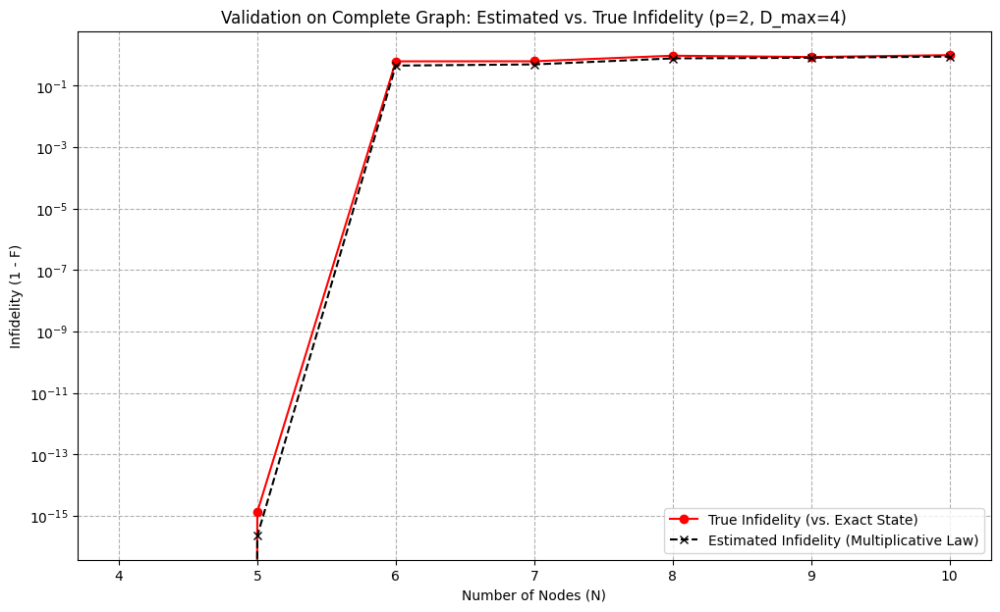

#### 3. Main Result: The "Fidelity Floor" and the Limit of Simulation

**Goal:** To demonstrate how simulation accuracy is fundamentally limited by the problem's connectivity.

**Method:** We plotted the infidelity vs. computational resources (χ) for two distinct topologies:

Linear Chain (N=12, p=8): An "easy" case where the 1D MPS structure matches the problem.

Complete Graph (N=8, p=2): A "hard" case with all-to-all connectivity, requiring many SWAP operations.

**Finding:** For the linear chain, increasing χ leads to exponentially better accuracy. For the complete graph, the accuracy quickly hits a "fidelity floor" ($\epsilon_{\infty}$), and providing more resources yields diminishing returns.

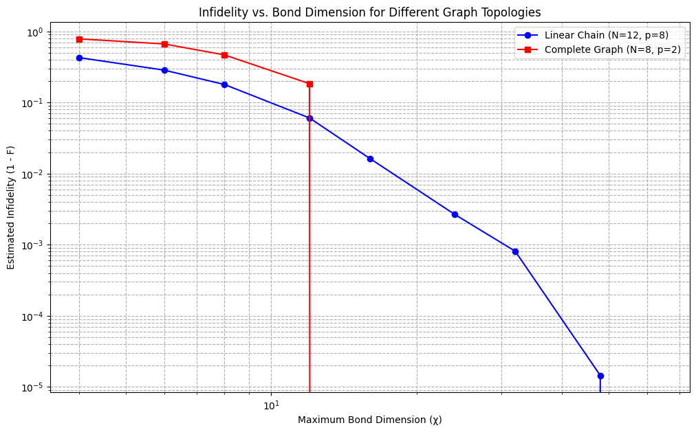

## Current Status & Next Steps (Future Work)

The Python framework is now functional for simulating QAOA on general graphs and has yielded key insights into the relationship between problem topology and classical simulation difficulty.

Our future work is planned to include:

- **Extend to Tree Tensor Networks (TTNs):**
  - Explore TTNs as a more flexible tensor network representation, especially for circuits with hierarchical or non-local entanglement patterns. This is a crucial next step, building on existing research within our group.
  - TTNs offer potential advantages for simulating circuits with more complex connectivity than 1D chains.

- **Performance Optimization:**
  - Optimize Python code for speed (e.g., JIT compilation, GPU acceleration).
  - Integrate with specialized tensor network libraries for higher performance.
