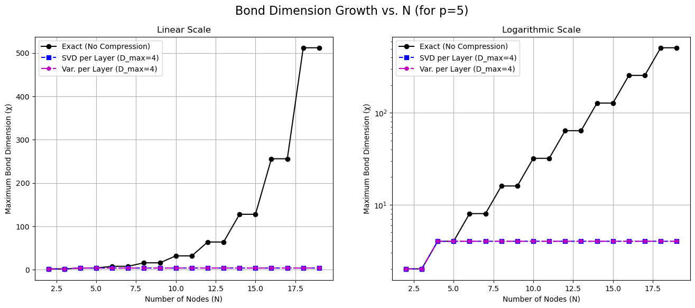
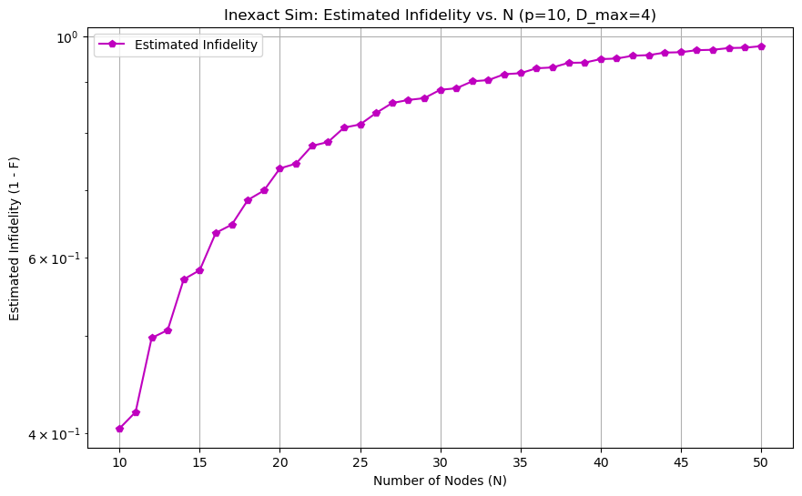

# Classical Simulation of Quantum Circuits using Tensor Networks (Ongoing Work)

## Overview

This repository documents ongoing work and initial findings from a research internship focused on the classical simulation of quantum circuits using Tensor Networks, specifically Matrix Product States (MPS) as of now. The primary objective is to explore and advance the capabilities of TN-based methods for simulating Quantum Approximate Optimization Algorithms (QAOA) for combinatorial optimization problems and to investigate Quantum Supremacy. The Python framework used for these simulations is under continuous development and refinement.

## Project Scope & Methods

The project involves:

- **Theoretical Foundations:** Deep understanding and implementation of MPS, various tensor decompositions (SVD, QR, RQ), canonical forms, and QAOA's principles (origins, Hamiltonians, problem mapping).
- **Python Framework:** Development of a modular Python framework leveraging NumPy for efficient tensor operations, implementing core MPS functionalities (canonicalization, gate application, utilities) and QAOA simulation routines.
- **Simulation Approaches:** Implementation and analysis of both exact and inexact (SVD and Variational) compression strategies.

## Key Initial Results

The simulations presented here are initial findings, primarily conducted on the Linear Max-Cut problem, mapping it through QUBO to an Ising Hamiltonian.

### 1. Entanglement Growth: Exact Simulation

**Initial Observation:** In exact simulations (without compression), the maximum bond dimension (χ) of the MPS exhibits exponential growth with both the number of nodes (N) and the number of QAOA layers (p). This underscores the fundamental classical simulation bottleneck.

| Max Bond Dimension vs. Number of Nodes (N) | Max Bond Dimension vs. QAOA Layers (p) |
| :----------------------------------------: | :------------------------------------: |
|  |  |

### 2. Entanglement Growth: Exact vs. Compressed Simulation

**Initial Observation:** Implementing compression strategies effectively caps the bond dimension at a fixed maximum value (χ_max = 4), regardless of the increasing system size (N) or circuit depth (p).

**Implication:** This capping enables polynomial scaling of simulation cost, making it feasible to analyze much larger or deeper quantum circuits than exact methods.

| Max Bond Dimension vs. Number of Nodes (N) | Max Bond Dimension vs. QAOA Layers (p) |
| :----------------------------------------: | :------------------------------------: |
|  |  |

### 3. Infidelity Analysis: Exact Reference

**Goal:** To quantify the approximation error (infidelity = 1 − |⟨Ψ_exact|Ψ_inexact⟩|²) by comparing against a computationally generated exact state (Ψ_exact) for small systems.

**Strategies Compared (χ_max = 4):**
- SVD per Layer, Variational per Layer
- SVD at End, Variational at End

**Initial Findings:**
- Infidelity generally increases with N and p.
- "Per Layer" compression methods tend to yield higher or equal infidelity compared to "at End" methods.
- Variational compression consistently outperforms SVD compression, achieving lower infidelity.

| Infidelity vs. Number of Nodes (N) | Infidelity vs. QAOA Layers (p) |
| :--------------------------------: | :----------------------------: |
|  |  |

### 4. Validating Inexact Fidelity Estimation

**Challenge:** For large quantum systems, the exact state (Ψ_exact) is computationally unreachable.

**Solution:** The Multiplicative Fidelity Law (F_total ≈ ∏ f_δ) is used to estimate infidelity from local partial fidelities calculated during the inexact simulation.

**Initial Validation:** The estimated infidelity closely tracks the true infidelity for small systems.

**Implication:** This validation confirms that the Multiplicative Fidelity Law provides a reliable method to assess simulation accuracy even when exact results are unknown.

### 5. Performance of Inexact Simulations (Estimated Infidelity)

**Method:** Evaluating the performance of inexact simulations by plotting the estimated infidelity (using the Multiplicative Fidelity Law) for fixed χ_max = 4.

**Initial Finding:** The estimated infidelity shows a saturating trend as both the number of nodes (N) and QAOA layers (p) increase.

**Implication:** This indicates a predictable error profile for scalable quantum circuit analysis.

| Estimated Infidelity vs. Number of Nodes (N) | Estimated Infidelity vs. QAOA Layers (p) |
| :------------------------------------------: | :--------------------------------------: |
|  |  |

## Current Status & Next Steps (Future Work)

This project has established a strong foundation in MPS-based quantum circuit simulation. The Python framework is functional and has yielded initial insights into QAOA performance.

Our future work is planned to include:

- **Extend to Tree Tensor Networks (TTNs):**
  - Explore TTNs as a more flexible tensor network representation, especially for circuits with hierarchical or non-local entanglement patterns. This is a crucial next step, building on existing research within our group.
  - TTNs offer potential advantages for simulating circuits with more complex connectivity than 1D chains.

- **Advanced QAOA Applications:**
  - Simulate QAOA on more complex graph structures and optimization problems.
  - Investigate the impact of different mixer Hamiltonians on performance.

- **Performance Optimization:**
  - Optimize Python code for speed (e.g., JIT compilation, GPU acceleration).
  - Integrate with specialized tensor network libraries for higher performance.

## Acknowledgments

This work is being conducted during a research internship at the Center for Optical Quantum Technologies, University of Hamburg, Germany.

Special thanks to:
- Prof. Dr. Peter Schmelcher (Supervisor)
- Mr. Zeki Zeybek (PhD Student)
